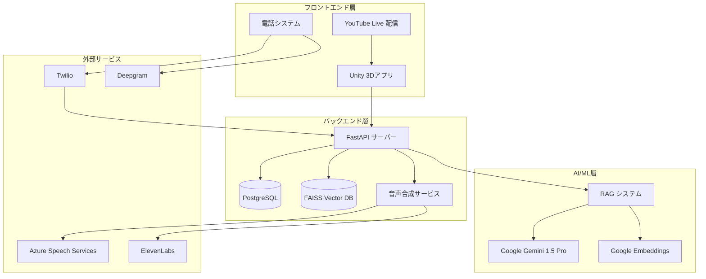
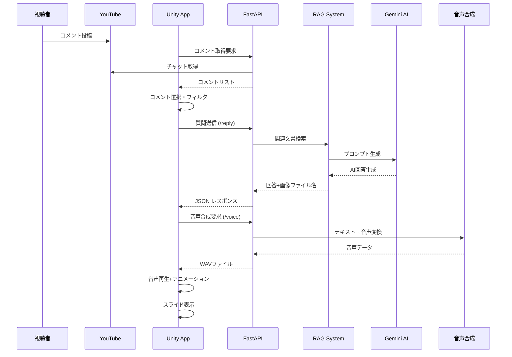
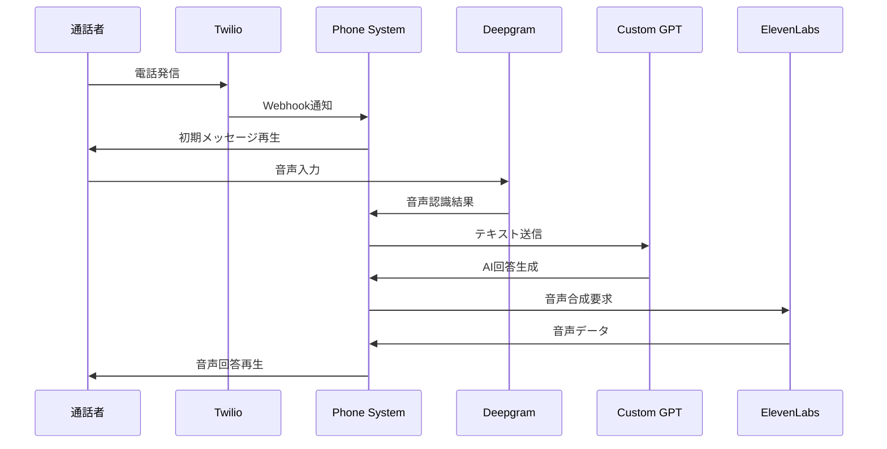
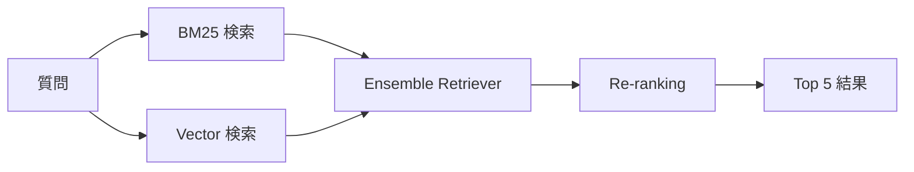

# AIあんの プロジェクト理解ドキュメント

## 📋 プロジェクト概要

**AIあんの**は、2024年東京都知事選で使用された革新的なバーチャルアバターシステムです。実在する政治候補者（安野たかひろ氏）の政策や考え方を学習したAIが、YouTubeライブ配信や電話を通じて有権者からの質問に対応するシステムです。

### 🎯 主要目的
- **デジタル民主主義の実現**: AIを活用した政治参加の新しい形
- **24時間対応**: 候補者の代わりにAIが常時質問に対応
- **政策の正確な伝達**: RAG（Retrieval Augmented Generation）による根拠ある回答
- **アクセシビリティ向上**: 多様な手段での情報アクセス

## 🏗️ システム構成図



## 🔧 主要コンポーネント詳細

### 1. Unity 3Dアプリケーション (`aituber_3d/`)

**役割**: バーチャルアバターの表示とユーザーインターフェース

#### 主要機能
- **3Dアバター表示**: VRMモデルを使用した3Dキャラクター
- **YouTubeコメント取得**: リアルタイムでライブチャットを監視
- **音声合成・再生**: AIの回答を音声で再生
- **アニメーション制御**: 発話に合わせたリップシンクとジェスチャー
- **スライド表示**: 政策資料の自動表示

#### 主要スクリプト

| ファイル | 役割 |
|---------|------|
| `QueueManager.cs` | 質問キューの管理と処理フロー制御 |
| `YouTubeChatDisplay.cs` | YouTubeチャットの取得と表示 |
| `TextToSpeech.cs` | 音声合成との連携 |
| `SlideDisplayer.cs` | 政策スライドの表示制御 |
| `CommentPanelManager.cs` | コメント表示UI管理 |

### 2. Python バックエンドサーバー (`python_server/`)

**役割**: AI回答生成、RAGシステム、音声合成

#### 主要機能
- **RAG (Retrieval Augmented Generation)**: 政策文書から関連情報を検索
- **AI回答生成**: Google Gemini 1.5 Proによる自然な回答生成
- **ハルシネーション検出**: 回答の品質チェック機能
- **音声合成**: 複数のTTSサービスへの対応
- **YouTubeチャット管理**: コメントのフィルタリングと管理

#### API エンドポイント

| エンドポイント | メソッド | 説明 |
|---------------|---------|------|
| `/reply` | POST | AI回答生成のメイン機能 |
| `/voice` | POST | 音声合成（デフォルト） |
| `/voice/azure` | POST | Azure Speech Services |
| `/voice/male` | POST | 男性音声での合成 |
| `/youtube/chat_message` | GET/POST | YouTubeチャット管理 |
| `/filter` | POST | コメントフィルタリング |
| `/get_info` | GET | RAG情報取得 |
| `/hallucination` | POST | ハルシネーション判定 |

### 3. 電話システム (`phonecall/`)

**役割**: 音声通話によるAI対話

#### 主要機能
- **音声認識**: Deepgram APIによる高精度音声認識
- **リアルタイム対話**: ストリーミング音声処理
- **音声合成**: ElevenLabsによる自然な音声生成
- **通話制御**: Twilioによる電話回線制御

## 📊 システムフロー図

### YouTubeライブ配信での質疑応答フロー



### 電話での音声対話フロー



## 🔍 RAG (Retrieval Augmented Generation) システム

### データソース

1. **政策マニフェスト**: 118件の政策文書
2. **FAQ データベース**: 253件の想定質問・回答
3. **スライド画像**: 107枚の政策説明用画像

### 検索手法



#### 使用技術
- **Vector検索**: Google Text Embedding 004
- **キーワード検索**: BM25 Retriever
- **ハイブリッド検索**: Ensemble Retriever
- **データベース**: FAISS (Facebook AI Similarity Search)

### ハルシネーション検出

AIの回答品質を保証するため、以下のクラス分類でハルシネーションを検出：

| クラス | 説明 |
|-------|------|
| 0 | 適切な回答（ハルシネーションなし） |
| 1 | RAG知識と矛盾する回答 |
| 2 | 存在しない人物・事実・概念への言及 |

## 🛠️ 技術スタック

### バックエンド
- **フレームワーク**: FastAPI
- **AI Model**: Google Generative AI (Gemini 1.5 Pro)
- **Vector Search**: FAISS + Google Embeddings
- **Database**: PostgreSQL
- **Package Management**: Poetry
- **言語**: Python 3.12

### フロントエンド（Unity）
- **エンジン**: Unity 2022.3.29f1
- **3Dモデル**: VRM 1.0
- **非同期処理**: UniTask
- **UI**: TextMeshPro, uGUI
- **アニメーション**: Timeline, Cinemachine

### 音声処理
- **音声合成**: Azure Speech Services, ElevenLabs
- **音声認識**: Deepgram API
- **電話制御**: Twilio
- **ストリーミング**: Vocode

## 📁 ディレクトリ構成

```
ai-anno/
├── 📁 aituber_3d/              # Unity 3Dアプリケーション
│   ├── 📁 Assets/
│   │   ├── 📁 Scripts/         # C# スクリプト
│   │   ├── 📁 VRM/            # 3Dアバターモデル
│   │   ├── 📁 Resources/       # リソースファイル
│   │   └── 📁 Scenes/         # Unityシーン
│   └── 📁 Packages/           # Unity パッケージ設定
│
├── 📁 python_server/          # バックエンドサーバー
│   ├── 📁 src/
│   │   ├── 📁 web/            # FastAPI アプリケーション
│   │   ├── 📁 cli/            # CLIツール群
│   │   ├── 📁 databases/      # データベース設定
│   │   └── 📁 streamlit/      # Streamlit UI
│   ├── 📁 faiss_knowledge/    # ナレッジベースDB
│   ├── 📁 faiss_qa/          # Q&A データベース
│   ├── 📁 PDF/               # マニフェスト資料
│   ├── 📁 Text/              # テンプレート・NGワード
│   └── 📁 qa_datasets/       # 評価用データセット
│
├── 📁 phonecall/              # 電話システム
│   ├── 📄 main.py            # メインアプリケーション
│   ├── 📄 custom_chatgpt_agent.py  # カスタムAIエージェント
│   └── 📄 docker-compose.yml  # Docker設定
│
└── 📁 docs/                   # プロジェクト資料
```

## ⚙️ セットアップ手順

### 1. 前提条件
- Git LFS
- Python 3.12
- Poetry
- PostgreSQL
- Unity 2022.3.29f1
- Poppler (PDF処理用)

### 2. バックエンド環境構築

```bash
# リポジトリクローン
git clone <repository-url>
cd ai-anno

# Python依存関係インストール
cd python_server
poetry install

# 環境変数設定
cp .env.example .env
# .envファイルを編集

# データベースセットアップ
sudo systemctl start postgresql
poetry run alembic upgrade head

# FAISSデータベース構築
make setup/resources

# サーバー起動
make run
```

### 3. Unity環境構築

```bash
# Unity起動
# SampleScene.unityを開く
# VRMパッケージをインポート
# Playボタンでテスト実行
```

### 4. 電話システム構築

```bash
cd phonecall
cp .env.sample .env
# .envファイルを編集
docker compose up
```

## 🧪 API仕様例

### 回答生成API

**エンドポイント**: `POST /reply`

**リクエスト**:
```bash
curl -X POST "http://127.0.0.1:7200/reply" \
  -H "Content-Type: application/x-www-form-urlencoded" \
  -d "inputtext=デジタル民主主義について教えてください"
```

**レスポンス**:
```json
{
  "response_text": "こんにちは！AIあんのです。デジタル民主主義について...",
  "image_filename": "slide_56.png"
}
```

### 音声合成API

**エンドポイント**: `POST /voice`

**リクエスト**:
```bash
curl -X POST "http://127.0.0.1:7200/voice?text=こんにちは" \
  -H "Content-Type: application/json"
```

**レスポンス**: `audio/wav` 形式の音声データ

## 🔧 カスタマイズガイド

### 1. 新しい政策文書の追加

```bash
# PDFを画像化
poetry run python -m src.cli.import_pdf

# CSVファイル作成（手動）
# マルチモーダルLLMでPDFからCSV生成

# FAISSデータベース更新
poetry run python -m src.cli.save_faiss_knowledge_db
```

### 2. キャラクター変更

1. VRMモデルを `Assets/VRM/` に配置
2. `SlideDisplayer.cs` で参照パス更新
3. アニメーションコントローラー調整

### 3. 音声カスタマイズ

```python
# ElevenLabsカスタムボイス
synthesizer_config=VolumeAdjustableElevenLabsSynthesizerConfig(
    voice_id="your_custom_voice_id",
    volume_factor=1.2
)
```

## 🚨 トラブルシューティング

### よくある問題

#### 1. Google API Quota Exceeded
```
Error: quota exceeded
```
**解決方法**: Google Cloud Consoleで請求先アカウントを設定

#### 2. PostgreSQL接続エラー
```
Error: could not connect to server
```
**解決方法**: 
- サービス状態確認: `sudo systemctl status postgresql`
- 接続設定確認: `.env`ファイルの設定を再確認

#### 3. FAISS インデックスが見つからない
```
Error: No such file or directory: 'faiss_knowledge/index.faiss'
```
**解決方法**: `make setup/resources`を再実行

#### 4. Unity VRM エラー
- Universal RP パッケージのインストール
- UniVRM パッケージの最新版導入

### ログ確認方法

```bash
# サーバーログ
poetry run uvicorn src.web.api:app --log-level debug

# 対話ログ
tail -f logs/interaction.log

# Unity Console ログ
# Unity Editor の Console タブを確認
```

## 📈 パフォーマンス指標

### システム応答時間
- **平均応答時間**: 3-5秒
- **音声合成時間**: 1-2秒
- **RAG検索時間**: 0.5-1秒

### データベース性能
- **ナレッジベース**: 118件（政策）
- **FAQ データ**: 253件
- **ベクトル次元**: 768次元
- **検索精度**: F1スコア 0.85以上

## 🔮 将来の改善案

### 技術的改善
1. **多様なフォールバック**: ランダムなデフォルト回答
2. **リアルタイム学習**: 新しい質問への動的対応
3. **多言語対応**: 国際的な有権者対応
4. **感情認識**: 音声からの感情分析

### 機能拡張
1. **ビデオ通話対応**: Zoom, Teams連携
2. **チャットボット**: Webサイト埋め込み
3. **分析ダッシュボード**: 質問傾向の可視化
4. **候補者間討論**: 複数AIキャラクターの対話

## 📝 ライセンス

このプロジェクトは **GPL-3.0 License** の下で公開されています。

- 自治体等の組織利用時は個別相談可能
- コントリビューション時はCLA (Contributor License Agreement)への同意が必要
- 連絡先: takahiroanno2024@gmail.com

## 🤝 貢献方法

1. **Issues**: バグ報告や機能要望
2. **Pull Requests**: コード改善の提案
3. **Documentation**: ドキュメント改善
4. **Testing**: 品質向上への協力

---

**最終更新**: 2025年6月12日  
**バージョン**: 1.0  
**作成者**: AI-Anno Team